# 📊 **Tampilan Web**

  

    

Proyek ini adalah sistem berbasis Web DataBase dengan fitur terpisah untuk **Admin** dan **User**.

---

## 🔐 **Form Login**

### Admin
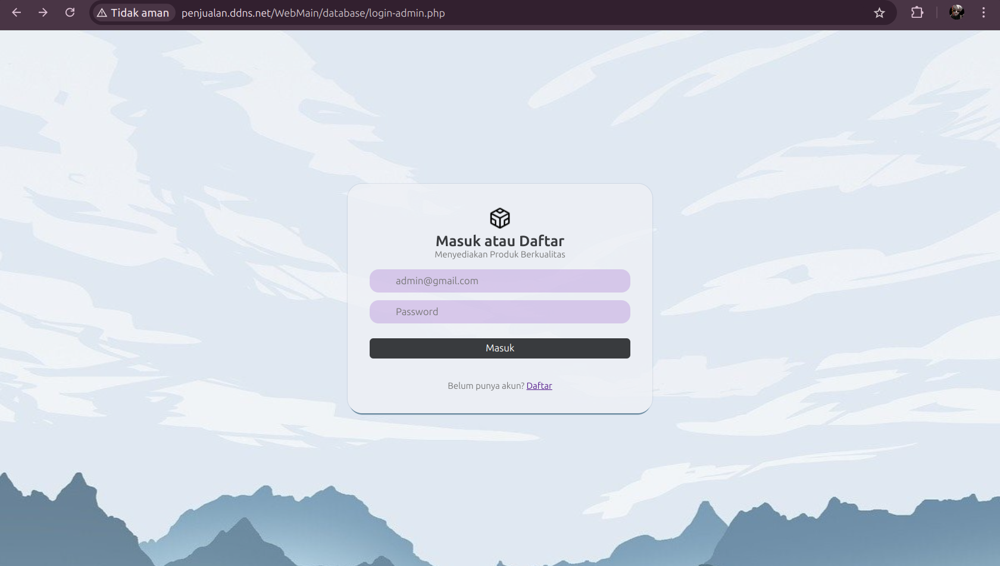

### User
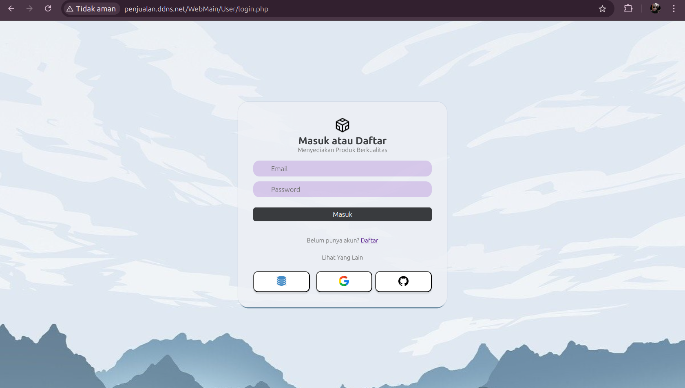

---

## 🛠️ **Admin Interface**

Berikut adalah fitur yang tersedia untuk Admin:

- **Dashboard**: Menampilkan ringkasan aktivitas dan data sistem.
- **Manajemen Barang**: Mengelola barang masuk dan keluar.
- **Riwayat Transaksi**: Menyimpan catatan aktivitas Keluar-Masuk.

### **Tampilan Dashboard**
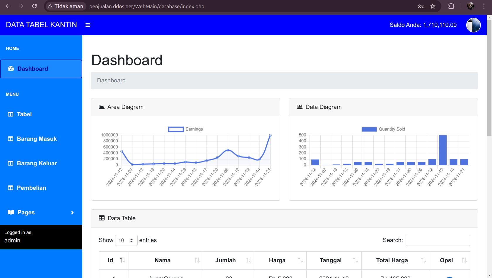

### **Tabel Data**
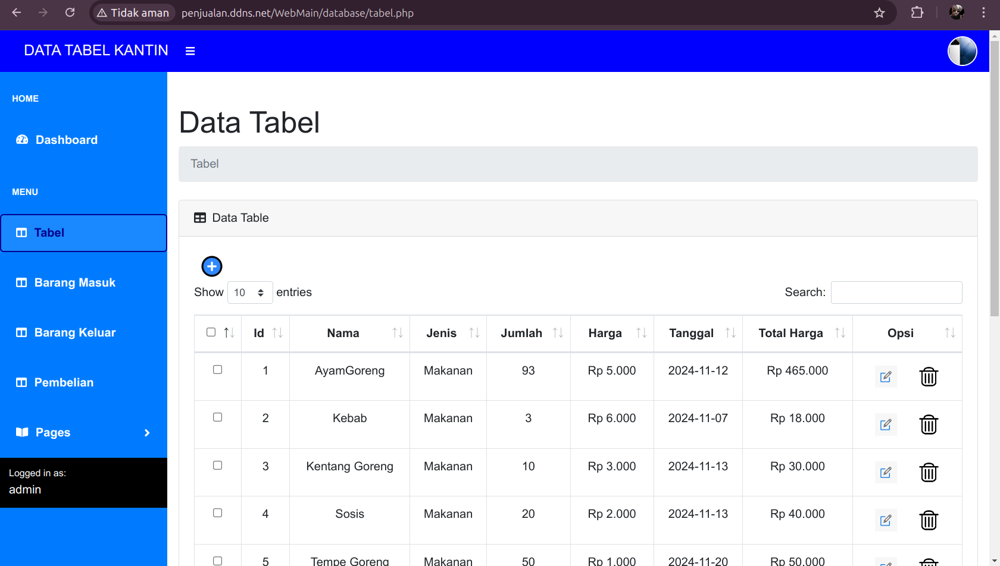

### **Barang Masuk**
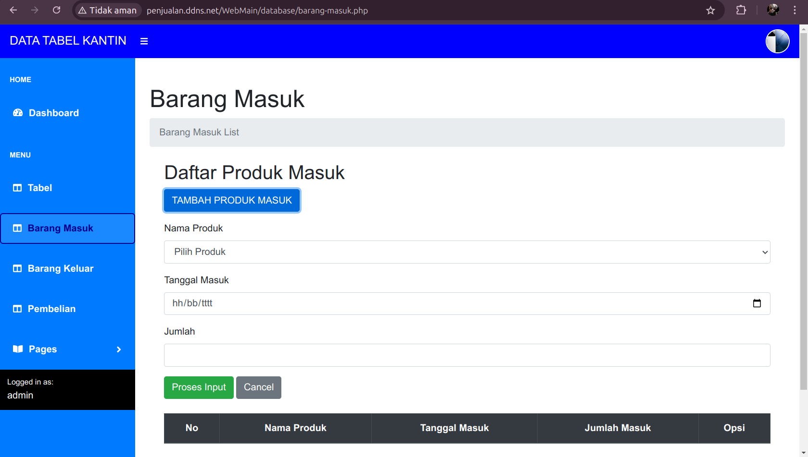

### **Barang Keluar**
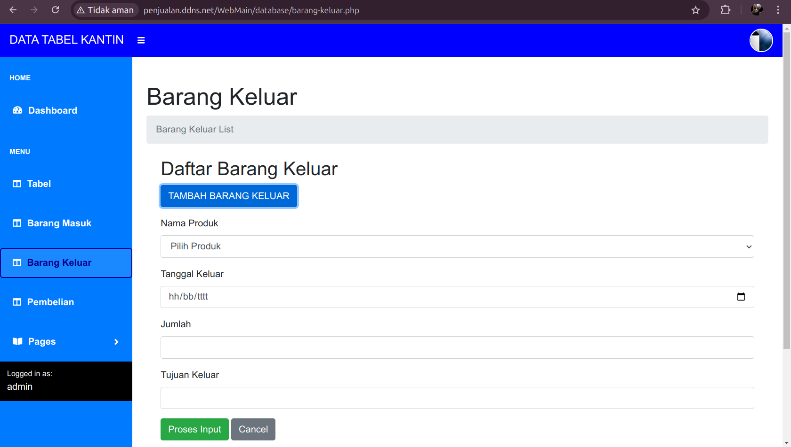

### **Pembelian**
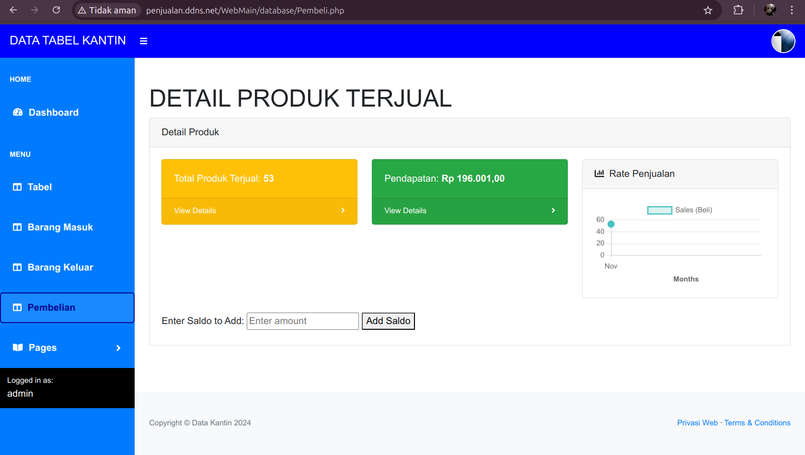

### **Riwayat Transaksi**
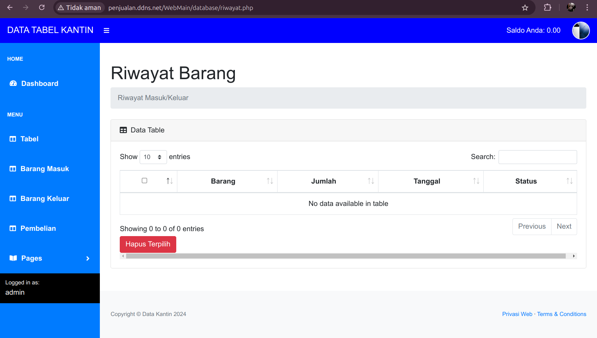

---

## 🛍️ **User Interface**

Antarmuka pengguna dirancang untuk mempermudah belanja online. Fitur utama meliputi:

- **Beranda**: Informasi umum tentang produk.
- **Toko**: Menampilkan semua produk yang tersedia .
- **Keranjang**: Tempat untuk menyimpan produk sebelum pembelian.
- **Profil**: Mengelola data pengguna.

### **Home**
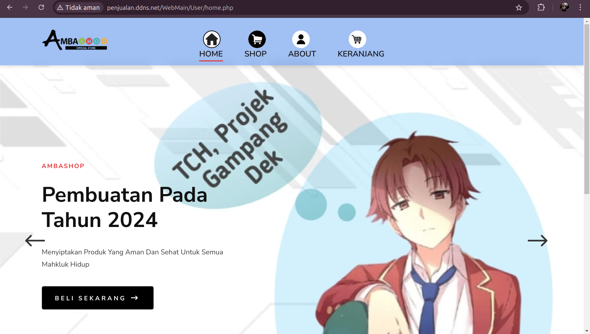

### **Shop**
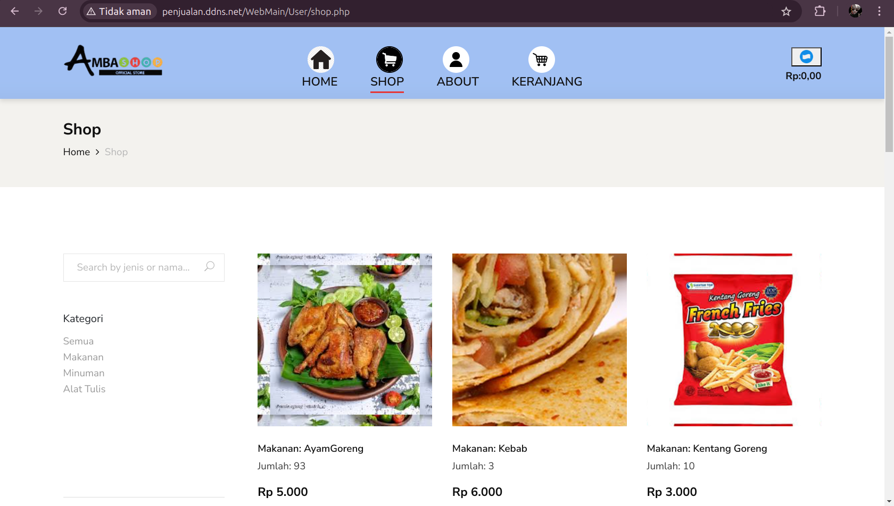

### **Profil**
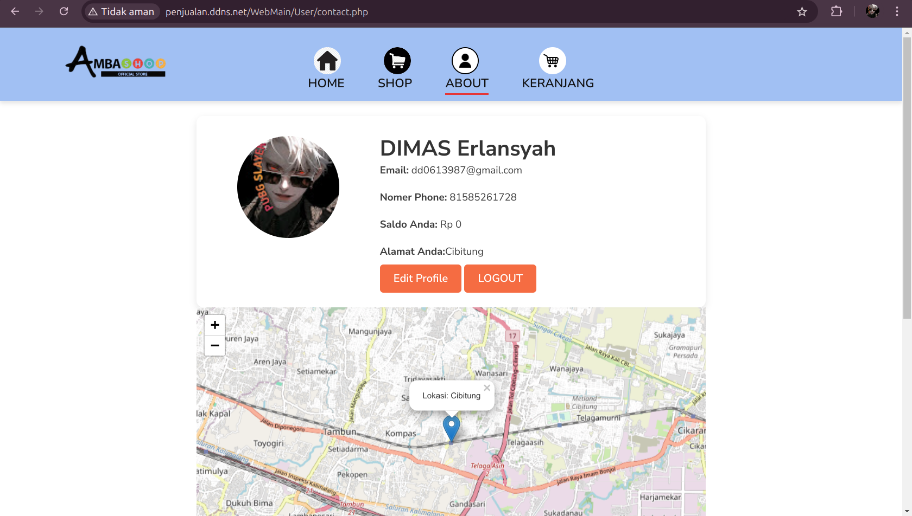

### **Keranjang**
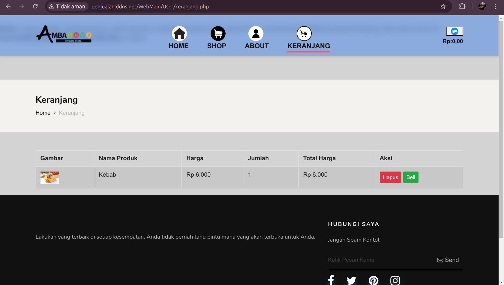

---

### **Fitur Unggulan :**

 Penggunaan API google console

- Map Tracking
- Email Send
- OTP VERIFICATION proces

---